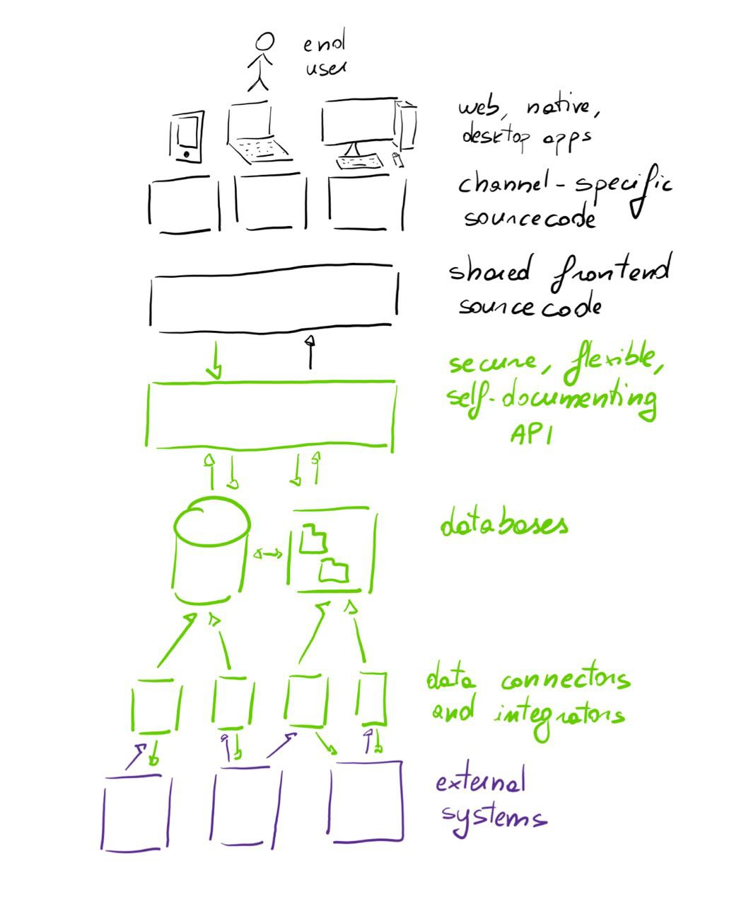

# Architecture

How tall can the building be? It depends on the foundations.

Whenever we build something complex, layered, and interconnected, "just start building and see" does not work. Even a good setup can turn out to be a very costly mistake if the original architecture did not take into account all the requirements. For example, sticking to the housing construction metaphor: suppose you build a house, and then when the new owner inspects it they decide that the bathroom should be in another room, one without plumbing ready! Then you will have to demolish and redo a lot of walls or floors, lay the plumbing, before you can even start putting down the new bathroom in the desired location.

Software is just like this. When we build an application, we must factor in everything that will happen in the application in terms of data sources, load, security, and much more, both now and in the future. Of course we cannot fully know what will happen years from now, but very often a well thought roadmap can give us plenty of indications about where the system is likely to evolve rapidly (those bits need to be isolated and modular so that they can change quickly) and where the system will likely remain stable.

## Architectural elements from a bird's eye
Whenever we design an architecture, we need to take a series of elements into account. I always like to **start with the data**, because nothing matters if the data is not in order and every other choice depends on the flow and structure of the data. 

Then we need a **platform to host** everything on, and it needs to be fit for purpose in terms of security, reliability, but also simplicity and maintenance and price (modern infrastructure often gets out of hand very quickly and very badly).

Then we need to **connect to the various external systems**. Unless we are building everything down to the ERP and CRM from scratch (WHICH IS NOT A GOOD IDEA!!!!!), we will need to connect to many systems, usually in such a way that even if they are not available for a period of time the rest of the architecture keeps functioning.

At this point, we need to **present data via API** for omnichannel/multichannel consumption.

Finally, we can use this API to give life to an omnichannel customer journey that uses a mix of **web, native, and sometimes even desktop apps** to encompass everything the end user needs to achieve. 

And voilà, here's our architecture!

## In short
Ensuring successful development now and in the future requires careful architectural analysis, so that we avoid dead-ends and support successful, qualitatively high continuous development of our software.

We need to understand business requirements and their roadmap, and make sure that we understand how those requirements are best served at each layer.

<!-- Would you like to take a look at the security of a web application together? 
>> Contact form <<>> -->

